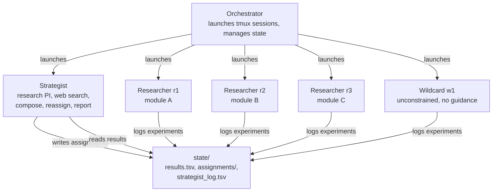
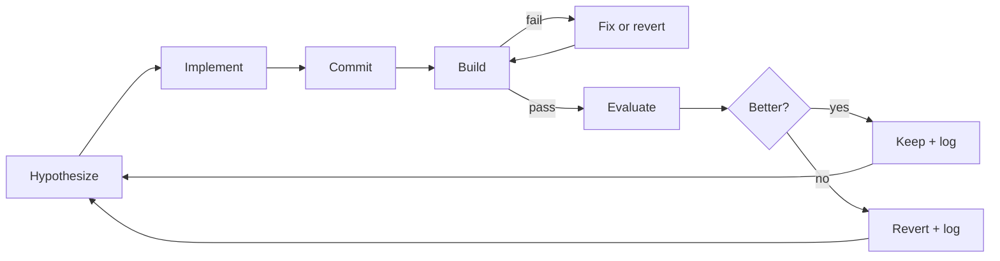
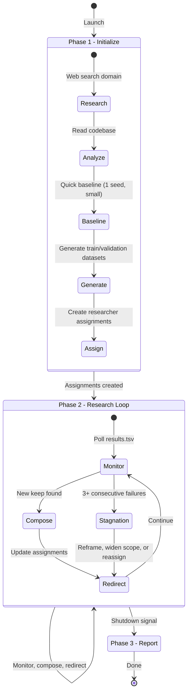

# AlgoForge

A hierarchical multi-agent system that evolves algorithms through autonomous experimentation.

Give AlgoForge a codebase, a build step, and a benchmark — it will coordinate a team of AI coding agents to systematically improve the code's performance. The strategist researches the domain, decomposes the problem, and directs parallel researchers who each evolve a piece of the codebase in a tight loop: hypothesize, implement, build, evaluate, keep or revert.

## Architecture



The orchestrator is a thin Python layer that launches a tmux session with one window per agent. The real work happens in the coding agents (Claude Code, Codex, etc.) — each pointed at a markdown instruction file.

### Agent Types

**Strategist** — the research PI. Analyzes the codebase, researches the domain via web search, decomposes the code into modules, assigns work, actively redirects researchers based on interim results, incrementally composes the best modules into a combined build, and writes the final report.

**Researchers** — N parallel workers (defaults to one per module, configurable). Each runs autonomously in its own git worktree, evolving its assigned module. The loop: read the code, form a hypothesis, edit, commit, build, benchmark, keep or revert. Indefinitely, until stopped.

**Wildcard** — an optional unconstrained researcher. No assignment from the strategist, no web search, no experiment history. Reads only the source code and benchmarks. Forces genuine novelty by avoiding the convergence trap where all researchers gravitate toward the same ideas.

## What Can AlgoForge Evolve?

Any codebase where you can compile, run against benchmarks, and get a number back. The requirements are simple: code + build step + measurable metric.

| Domain | Examples |
|---|---|
| **Combinatorial Optimization** | Routing heuristics, vehicle routing, graph coloring, bin packing, scheduling |
| **Search & Solvers** | SAT solvers, constraint satisfaction, branch-and-bound, local search frameworks |
| **Numerical Computing** | Matrix multiplication kernels, sorting algorithms, compression, signal processing |
| **ML Training** | Neural network training loops, optimizer implementations, data augmentation |
| **Compilers** | Optimization passes, code generation heuristics, register allocation |

The domain-agnostic design means AlgoForge doesn't need to be pre-configured for any specific problem type. The strategist researches the domain autonomously via web search.

## User Guide

### Prerequisites

- Python 3.11+
- [Claude Code](https://docs.anthropic.com/en/docs/claude-code) (or another coding agent with a CLI)
- tmux (`brew install tmux`)
- Git

### Step 1: Install AlgoForge

```bash
git clone https://github.com/manganganath/AlgoForge.git
cd AlgoForge
pip install -e .
```

### Step 2: Prepare Your Project

Create a project directory with your seed codebase and holdout benchmarks:

```
my-project/
├── config.yaml
├── seed/               # your algorithm's source code
├── datasets/
│   └── holdout/        # established benchmark instances (final eval only)
└── eval.sh             # script that runs binary on one instance, outputs a number
```

The strategist will generate `datasets/train/` and `datasets/validation/` automatically during initialization, in the same format as the holdout files.

### Step 3: Write config.yaml

```yaml
project:
  name: "my-algorithm"
  mode: "evolve"            # evolve (from seed) or generate (from scratch)
  seed_path: "./seed/"
  language: "c"

modules:                    # the strategist can refine these after analyzing the code
  - name: "core_logic"
    files: ["src/core.c"]
    description: "Main algorithm logic"
  - name: "heuristics"
    files: ["src/heuristic.c"]
    description: "Heuristic evaluation functions"

build:
  command: "make -j4"
  binary: "./solver"

benchmarks:
  small: ["datasets/holdout/small_*.txt"]
  medium: ["datasets/holdout/med_*.txt"]
  large: ["datasets/holdout/large_*.txt"]

evaluation:
  metric: "gap_to_optimal"
  runs_per_instance: 5
  random_seeds: [42, 123, 456, 789, 1024]

agents:
  tool: "claude"
  strategist:
    model_flags: "--model opus"
  researchers:
    # count is optional — defaults to one per module
    # count: 3
    model_flags: "--model sonnet"
    max_iterations_per_assignment: 20
  wildcard:                           # optional
    model_flags: "--model opus"

stopping_conditions:
  max_total_iterations: 500
  max_hours: 24
  stagnation_window: 50
```

### Step 4: Initialize and Run

```bash
cd my-project

# Initialize (creates state directory, git branches)
algoforge init --config config.yaml

# Run (launches tmux session with all agents)
algoforge run config.yaml
```

### Step 5: Monitor

**Live dashboard** (recommended) — open a separate terminal:
```bash
cd my-project
bash path/to/algoforge/src/algoforge/dashboard.sh state 5
```

Shows real-time progress: per-researcher keep/discard counts, recent experiments, strategist actions.

```
┌──────────────────────────────────────────────────────────────┐
│  AlgoForge Dashboard  14:32:15              Runtime: 42m 3s  │
├──────────────────────────────────────────────────────────────┤
│  Experiments: 17    keep: 4     discard: 11    crash: 2     │
├──────────────────────────────────────────────────────────────┤
│  r1   (core_logic)         ██░░░░░░░░  1 keep / 5 disc     │
│  r2   (heuristics)         ████░░░░░░  2 keep / 8 disc     │
│  r3   (perturbation)       ██████████  1 keep / 0 disc     │
│  w1   (wildcard)           █████░░░░░  1 keep / 1 disc     │
├──────────────────────────────────────────────────────────────┤
│  Recent experiments:                                         │
│  14:31:21 r2   discard dampened warm fallback                │
│  14:30:41 r1   discard extend break to outer loops           │
│  14:28:29 r3   keep    expensive edge first in X2 loop       │
├──────────────────────────────────────────────────────────────┤
│  Strategist: 4 actions                                       │
└──────────────────────────────────────────────────────────────┘
```

**tmux** — attach directly to watch agents work:
```bash
tmux attach -t algoforge
# Ctrl+B then 1-5 to switch windows, Ctrl+B d to detach
```

**CLI** — quick status check:
```bash
algoforge status
```

### Step 6: Stop and Report

```bash
# Graceful stop — finishes current iterations, strategist writes report
algoforge stop

# Or generate report from a completed/stopped run
algoforge report
```

The strategist writes a comprehensive report to `report/report.md` covering what was tried, what worked, benchmark comparisons, and a description of the evolved algorithm.

### Tips

- **Start small.** Use 2-3 researchers and small benchmarks first. Scale up once you see the loop working.
- **Let it run overnight.** Each researcher can do ~10-12 experiments per hour. An overnight run gives you 80-100 experiments per researcher.
- **Check `state/results.tsv`** for a quick view of all experiments across all researchers.
- **The strategist is the bottleneck.** It needs to compose, evaluate, and reassign. If researchers are idle, check the strategist window.
- **Seed code matters.** Start from the best available implementation. The agents evolve from there — they don't invent from scratch (in evolve mode).
- **Add the wildcard** for runs longer than an hour. Its unconstrained exploration is slower but can find ideas the directed researchers miss.

## How It Works

### The Experiment Loop

Each researcher runs this loop autonomously:



### Evaluation Strategy

Researchers evaluate mutations with a cost-aware, progressive approach:

- **1-seed screening** for large instances (>1000 nodes) — screen with 1 seed first, only run full 5-seed eval for promising changes. Saves 80% eval time on bad mutations.
- **Auto-promotion** — when small instances are saturated (0% gap), skip to medium/large.
- **Cost-aware keep/discard** — if a change makes trials >10% slower, it's discarded even if gap improves. Speed matters at composition.
- **Regression guard** — no single instance may regress by more than 2x.

### Dataset Split

AlgoForge uses a train/validation/holdout split to ensure improvements generalize rather than overfitting to specific benchmark instances:

| Dataset | Created by | Used by | Purpose |
|---|---|---|---|
| **Train** | Strategist (generated in same format as holdout) | Researchers | Iterate, keep/discard decisions |
| **Validation** | Strategist (separate set) | Strategist | Composition evaluation |
| **Holdout** | User (provided in config) | Report phase only | Final evaluation, never seen during development |

### Strategist Lifecycle



### Composition Strategy

The strategist composes modules **incrementally, best-first**:

1. Order modules by keep/discard ratio (strongest signal first)
2. Merge module A into main → build → evaluate
3. If it improves, keep it. If it regresses, skip it.
4. Merge module B → build → evaluate. And so on.
5. After a rejection, immediately try the next module (don't wait for a new trigger).

This catches conflicts early — e.g., one module speeds up trials while another adds preprocessing that cancels the speedup.

### Active Direction-Setting

The strategist doesn't just observe — it actively steers researchers:

- **Amplify what works** — if a researcher finds a promising direction, update their assignment to explore it deeper
- **Redirect from dead ends** — if a researcher's keeps get rejected at composition, add that constraint to their assignment
- **Cross-pollinate insights** — if one researcher discovers that speed matters more than quality, tell the others
- **Escalate on stagnation** — 3+ consecutive failures triggers: reframe objective → widen scope → cross-pollination → reassign

### Evolution Strategies

**Primary: Decomposed Module Evolution** — the strategist splits the codebase into modules. Each researcher evolves one module on a dedicated git branch. Natural parallelism without merge conflicts.

**Fallback: Cross-Pollination** — when module composition fails due to tight coupling, researchers fork the full codebase and evolve holistically. Last resort only.

## Design Principles

- **Agents are coding tool sessions**, not custom LLM infrastructure. AlgoForge doesn't make API calls — it launches Claude Code / Codex sessions pointed at instruction files.
- **Git is the state manager.** Worktrees for isolation, branches for versioning, tags for milestones.
- **Filesystem for communication.** Agents read/write a shared `state/` directory. No queues, no IPC.
- **The strategist has web search.** It can autonomously research unfamiliar domains, find papers, and discover seed code.
- **Train/validation/holdout split.** Researchers never see the holdout benchmark. Results are credible.
- **Cost-aware evaluation.** Changes that slow down trials are penalized, not just changes that worsen quality.
- **The wildcard breaks convergence.** One agent with no guidance, no history, no web search — forced to think from first principles.

## Tools

| Tool | Purpose | Usage |
|---|---|---|
| `algoforge init` | Initialize project | `algoforge init --config config.yaml` |
| `algoforge run` | Launch all agents via tmux | `algoforge run config.yaml` |
| `algoforge status` | Check progress | `algoforge status` |
| `algoforge stop` | Graceful shutdown | `algoforge stop` |
| `algoforge report` | Generate final report | `algoforge report` |
| `dashboard.sh` | Live terminal dashboard | `bash dashboard.sh state 5` |
| `generate_instances.py` | Create synthetic benchmarks | `python generate_instances.py --output datasets/train --count 10 --sizes small,medium,large --distributions uniform,clustered` |
| `eval.sh` | Run binary on one instance | `./eval.sh ./binary instance.tsp 42 60` |

## Project Structure

```
algoforge/
├── src/algoforge/
│   ├── cli.py                  # CLI entry point
│   ├── config.py               # config loading and validation
│   ├── state.py                # results.tsv, assignments, shutdown
│   ├── worktree.py             # git worktree management
│   ├── orchestrator.py         # tmux session launching and monitoring
│   ├── generate_instances.py   # synthetic benchmark generator
│   ├── eval.sh                 # benchmark evaluation script (macOS + Linux)
│   └── dashboard.sh            # live terminal dashboard
├── prompts/
│   ├── strategist.md           # strategist agent instructions
│   ├── researcher.md           # researcher agent instructions
│   └── wildcard.md             # wildcard agent instructions
├── examples/                   # example project configs
└── tests/
```
