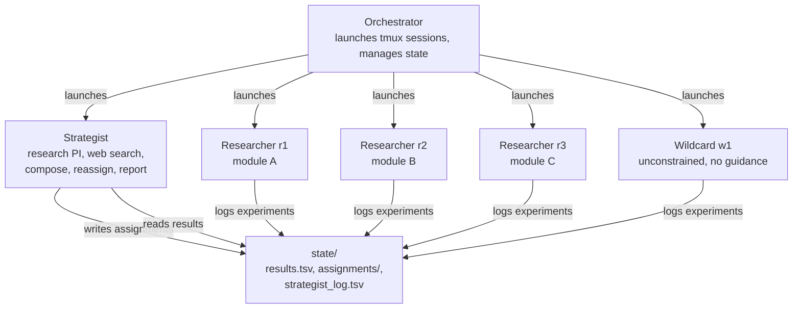
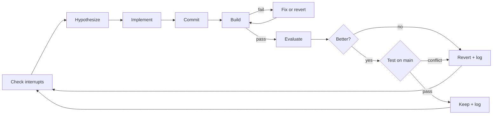

# MengerFlock

A hierarchical multi-agent system that evolves algorithms through autonomous experimentation.

Give MengerFlock a codebase, a build step, and a benchmark — it will coordinate a team of AI coding agents to systematically improve the code's performance. The strategist researches the domain, decomposes the problem, and directs parallel researchers who each evolve a piece of the codebase in a tight loop: hypothesize, implement, build, evaluate, keep or revert.

MengerFlock honors Karl Menger, an early pioneer of combinatorial optimization and the Traveling Salesman Problem, and "flock" reflects a coordinated group of AI research agents working together under a lead strategist to evolve better algorithms.

## Contents

- [Applicable Domains](#applicable-domains)
- [How It Works](#how-it-works)
- [Project Structure](#project-structure)
- [User Guide](#user-guide)
- [Citation](#citation)

## Applicable Domains

Any codebase where you can compile, run against benchmarks, and get a number back. The requirements are simple: code + build step + measurable metric.

| Domain | Examples |
|---|---|
| **Combinatorial Optimization** | Graph search, graph coloring, bin packing, job scheduling |
| **Search & Solvers** | SAT solvers, constraint satisfaction, branch-and-bound, local search frameworks |
| **Numerical Computing** | Matrix multiplication kernels, sorting algorithms, compression, signal processing |
| **ML Training** | Neural network training loops, optimizer implementations, data augmentation |
| **Compilers** | Optimization passes, code generation heuristics, register allocation |

The domain-agnostic design means MengerFlock doesn't need to be pre-configured for any specific problem type. The strategist researches the domain autonomously via web search.

> **Note:** MengerFlock has been tested on a few combinatorial optimization problems, but not rigorously across all listed domains. It should work for any domain that fits the code + build + metric pattern, but your mileage may vary.

## How It Works

### Architecture



The orchestrator is a thin Python layer that launches a tmux session with one window per agent. The real work happens in the coding agents (Claude Code, Codex, etc.) — each pointed at a markdown instruction file.

### Agents

**Strategist** — the research PI. Analyzes the codebase, researches the domain via web search, decomposes the code into modules, assigns work, actively redirects researchers based on interim results, incrementally composes the best modules into a combined build, and writes the final report.

**Researchers** — N parallel workers (defaults to one per module, configurable). Each runs autonomously in its own git worktree, evolving its assigned module. The loop: read the code, form a hypothesis, edit, commit, build, benchmark, keep or revert. Indefinitely, until stopped.

**Wildcard** — an optional unconstrained researcher. No assignment from the strategist, no web search, no experiment history. Works from the **original seed code** (not the evolving main branch) and reads only the high-level objectives. Writes results to the shared log, but cannot see other researchers' results or strategist directions. Forces genuine novelty by avoiding the convergence trap where all researchers gravitate toward the same ideas. The strategist reads wildcard findings and cross-pollinates useful ideas to regular researchers (one-way channel).

### Inputs and Outputs

**Inputs:**
| Input | Required | Description |
|---|---|---|
| Seed codebase (`seed/`) | Yes | The starting point for this iteration. On the first run, this is the unmodified algorithm. On subsequent runs, it contains improvements from prior iterations. |
| Original seed (`original-seed/`) | Yes | The unmodified algorithm as published. Never modified. Used for baseline comparison in Phase 3. On the first iteration, this is a copy of `seed/`. |
| Benchmarks (`datasets/holdout/`) | Yes | Holdout instances with known optimal values. Only used in Phase 3 evaluation. |
| Reference paper | No | PDF or URL describing the `original-seed` algorithm. If provided, the research report directly challenges it using the same evaluation methodology. Must correspond to the code in `original-seed/`. |

**Outputs:**
| Output | Condition | Path |
|---|---|---|
| Evolved codebase | Always | `seed/` on main branch of the experiment repo |
| Experimentation report | Always | `report/experimentation-report.md` — full log of all iterations, agents, compositions |
| Research report | Only if evolved beats baseline | `report/research-report.md` — challenges the original paper with same evaluation methodology, three-way comparison, and ablation study |

### The Experiment Loop

Each researcher runs this loop autonomously:



### Evaluation Strategy

Researchers evaluate mutations with a cost-aware, progressive approach:

- **1-seed screening** for large instances (>1000 nodes) — screen with 1 seed first, only run full 5-seed eval for promising changes. Saves 80% eval time on bad mutations.
- **Auto-promotion** — when small instances are saturated (0% gap), skip to medium/large.
- **Cost-aware keep/discard** — if a change makes trials >10% slower, it's discarded even if gap improves. Speed matters at composition.
- **Regression guard** — no single instance may regress by more than 2x.

### Dataset Split

MengerFlock uses a train/validation/holdout split to ensure improvements generalize rather than overfitting to specific benchmark instances:

| Dataset | Created by | Used by | Purpose |
|---|---|---|---|
| **Train** | Strategist (generated in same format as holdout) | Researchers | Iterate, keep/discard decisions |
| **Validation** | Strategist (separate set) | Strategist | Composition evaluation |
| **Holdout** | User (provided in config) | Report phase only | Final evaluation, never seen during development |

### Phase Lifecycle

MengerFlock runs in three phases with explicit gates between them. The orchestrator controls transitions; agents signal readiness via sentinel files in `state/`.

```mermaid
stateDiagram-v2
    [*] --> Phase1: Launch
    Phase1: Phase 1 — Initialize
    Phase1 --> Phase2: User approves plan (phase1_complete)

    Phase2: Phase 2 — Research Loop
    Phase2 --> Phase3: Stopping condition or phase2_complete

    Phase3: Phase 3 — Evaluate & Report
    Phase3 --> [*]: phase3_complete
    Phase3 --> Phase2: User approves re-entry (reenter_phase2)

    state Phase1 {
        [*] --> Research: Web search domain
        Research --> ReadPaper: Read reference paper (if provided)
        ReadPaper --> Analyze: Read codebase
        Analyze --> Present: Present research plan to user
        Present --> WaitApproval: WAIT for user approval
        WaitApproval --> WriteObjectives: Write state/objectives.md
        WriteObjectives --> Baseline: Run baseline on ALL holdout instances
        Baseline --> Generate: Generate train/validation datasets
        Generate --> Assign: Create researcher assignments
    }

    state Phase2 {
        [*] --> Monitor: Poll results.tsv
        Monitor --> Compose: New keep found
        Compose --> Redirect: Update assignments
        Redirect --> Monitor: Continue
        Monitor --> Stagnation: 3+ consecutive failures
        Stagnation --> Redirect: Reframe, widen scope, or reassign
    }

    state Phase3 {
        [*] --> HoldoutEval: Run holdout evaluation
        HoldoutEval --> Compare: Compare vs baseline
        Compare --> WriteExpReport: Write experimentation report (always)
        WriteExpReport --> BeatBaseline: Evolved beats baseline?
        BeatBaseline --> WriteResearchPaper: Yes — write research paper
        BeatBaseline --> AskUser: No — ask user to re-enter Phase 2
        WriteResearchPaper --> VerifyArtifacts: Verify all outputs exist
        AskUser --> ReenterOrDone: User decides
        VerifyArtifacts --> Done: Signal phase3_complete
    }
```



**Phase 1 → Phase 2 gate:** The strategist presents its research plan (domain findings, objectives, module decomposition, assignments) to the user and waits for explicit approval. Researchers are NOT launched until the user approves. The strategist signals readiness by writing `state/phase1_complete`.

**Phase 2 → Phase 3 gate:** Phase 2 ends when stopping conditions are met (max iterations, max hours, stagnation) or the strategist signals `state/phase2_complete`. The orchestrator stops all researcher and wildcard windows but keeps the strategist alive.

**Phase 3 → Done (or Phase 2 re-entry):** The strategist runs holdout evaluation, writes reports, and verifies all artifacts. If the evolved algorithm beats the baseline, it produces a research paper and signals `state/phase3_complete`. If not, it asks the user whether to re-enter Phase 2. The user must approve re-entry — it is not automatic. Maximum re-entries is configurable (`stopping_conditions.max_reentries`, default 2).

### Composition Strategy

The strategist composes modules **incrementally, best-first**:

1. Order modules by keep/discard ratio (strongest signal first)
2. Merge module A into main → build → evaluate
3. If it improves, keep it. If it regresses, skip it.
4. Merge module B → build → evaluate. And so on.
5. After a rejection, immediately try the next module (don't wait for a new trigger).

This catches conflicts early — e.g., one module speeds up trials while another adds preprocessing that cancels the speedup.

### Composition-First Evaluation

Before a researcher logs a "keep," it must test the change against the current main branch — not just its isolated worktree. This catches composition conflicts early:

1. Researcher makes a change that improves on its branch → candidate keep
2. Fetch latest main, cherry-pick the change onto it
3. If cherry-pick has conflicts → discard ("composition conflict")
4. Build and evaluate on main
5. If still improves → confirmed keep
6. If regresses on main → discard ("passed isolated, failed composition")

This prevents the strategist from discovering conflicts late during composition, saving significant time.

### Active Direction-Setting

The strategist doesn't just observe — it actively steers researchers:

- **Amplify what works** — if a researcher finds a promising direction, update their assignment to explore it deeper
- **Redirect from dead ends** — if a researcher's keeps get rejected at composition, add that constraint to their assignment
- **Cross-pollinate insights** — if one researcher discovers that speed matters more than quality, tell the others
- **Urgent interrupts** — when a researcher must change direction immediately, the strategist writes `state/interrupts/r<id>.md`. The researcher reads and acknowledges it at the start of the next iteration. This is faster than waiting for the researcher to re-read its assignment file.
- **Escalate on stagnation** — 3+ consecutive failures triggers: reframe objective → widen scope → cross-pollination → reassign

### Evolution Strategies

**Primary: Decomposed Module Evolution** — the strategist splits the codebase into modules. Each researcher evolves one module on a dedicated git branch. Natural parallelism without merge conflicts.

**Fallback: Cross-Pollination** — when module composition fails due to tight coupling, researchers fork the full codebase and evolve holistically. Last resort only.

### Design Principles

- **Agents are coding tool sessions**, not custom LLM infrastructure. MengerFlock doesn't make API calls — it launches Claude Code / Codex sessions pointed at instruction files.
- **Git is the state manager.** Worktrees for isolation, branches for versioning, tags for milestones.
- **Filesystem for communication.** Agents read/write a shared `state/` directory. No queues, no IPC.
- **The strategist has web search.** It can autonomously research unfamiliar domains, find papers, and discover seed code.
- **Train/validation/holdout split.** Researchers never see the holdout benchmark. Results are credible.
- **Cost-aware evaluation.** Changes that slow down trials are penalized, not just changes that worsen quality.
- **The wildcard breaks convergence.** One agent with no guidance, no history, no web search — forced to think from first principles.

## Project Structure

```
mengerflock/
├── src/mengerflock/
│   ├── cli.py                  # CLI entry point
│   ├── config.py               # config loading and validation
│   ├── state.py                # results.tsv, assignments, shutdown
│   ├── worktree.py             # git worktree management
│   ├── orchestrator.py         # tmux session launching and monitoring
│   ├── generate_instances.py   # synthetic benchmark generator
│   ├── eval.sh                 # benchmark evaluation script (macOS + Linux)
│   └── dashboard.sh            # live terminal dashboard
├── prompts/
│   ├── strategist.md           # strategist agent instructions
│   ├── researcher.md           # researcher agent instructions
│   └── wildcard.md             # wildcard agent instructions
├── project-template/             # template skeleton — copy and fill in
│   ├── original-seed/           # place your unmodified algorithm here
│   ├── datasets/holdout/        # place your benchmark instances here
│   ├── config.yaml              # sample config — edit for your project
│   ├── eval.sh                  # your evaluation script
│   └── paper.pdf                # optional: reference paper describing the algorithm
└── projects/                    # your experiment templates and results (gitignored)
```

## User Guide

### Prerequisites

- Python 3.11+
- [Claude Code](https://docs.anthropic.com/en/docs/claude-code) (or another coding agent with a CLI)
- tmux (`brew install tmux`)
- Git

### Install

```bash
git clone https://github.com/manganganath/mengerflock.git
cd mengerflock
pip install -e .
```

### Prepare Your Template

A template folder holds your algorithm's source code, benchmarks, and evaluation script. A starter skeleton is at `project-template/` — copy it and fill in your own files. Templates are not tracked in git (heavy data lives here).

The template includes a sample `config.yaml` with all sections. Key fields:

| Section | What to set |
|---|---|
| `project` | `name`, `seed_path`, `original_seed_path`, `language`, optional `paper` |
| `modules` | Initial decomposition (strategist can refine) |
| `build` | `command` (e.g., `make -j4` or `true` for Python) and `binary` |
| `benchmarks` | Glob paths to holdout instances (small/medium/large) |
| `evaluation` | Metric name, runs per instance, random seeds |
| `agents` | Tool CLI, model flags per role |
| `stopping_conditions` | Max iterations, hours, stagnation window |

### CLI

| Command | Purpose | Usage |
|---|---|---|
| `mengerflock new` | Create experiment from template | `mengerflock new <template> <name> [--seed-from <path>]` |
| `mengerflock run` | Launch all agents via tmux | `mengerflock run [config.yaml]` (defaults to `config.yaml`) |
| `mengerflock status` | Check progress | `mengerflock status` |
| `mengerflock stop` | Graceful shutdown | `mengerflock stop` |
| `mengerflock clean` | Reset experiment state | `mengerflock clean` (or `--force` to skip confirmation) |

### Example Workflow

```bash
# 1. Create experiment from template (copies seed, eval.sh, prompts, config)
mengerflock new projects/my-algo my-algo-experiment-1
cd my-algo-experiment-1

# 2. Review and edit config.yaml, then launch
mengerflock run

# 3. Monitor progress (in a separate terminal)
mengerflock status

# 4. Graceful stop — strategist enters Phase 3, writes reports
mengerflock stop

# 5. Reset if you want to rerun with different settings
mengerflock clean

# 6. Next iteration — start from evolved code of experiment-1
cd ..
mengerflock new projects/my-algo my-algo-experiment-2 --seed-from my-algo-experiment-1
```

### Model Selection

| Role | Recommended | Why |
|---|---|---|
| **Strategist** | Most capable (e.g., opus) | Domain research, composition reasoning, cross-pollination decisions, report writing. The strategist's judgment drives the entire experiment. |
| **Researchers** | Fast and capable (e.g., sonnet) | Focused edit-test loops on assigned modules. Speed matters — more experiments per hour means more coverage. |
| **Wildcard** | Most capable (e.g., opus) | No guidance from strategist, no domain context, no web search. Must reason about the code from first principles. Stronger models produce more creative hypotheses. |

If budget is limited, prioritize the strategist — a weak strategist with strong researchers wastes the researchers' output on poor composition decisions. A strong strategist with weaker researchers can still extract value through good direction-setting.

### Tips

- **Start small.** Use 2-3 researchers and small benchmarks first. Scale up once you see the loop working.
- **Let it run overnight.** Each researcher can do ~10-12 experiments per hour. An overnight run gives you 80-100 experiments per researcher.
- **Check `state/results.tsv`** for a quick view of all experiments across all researchers.
- **The strategist is the bottleneck.** It needs to compose, evaluate, and reassign. If researchers are idle, check the strategist window.
- **Seed code matters.** Start from the best available implementation. The agents evolve from there — they don't invent from scratch.
- **Add the wildcard** for runs longer than an hour. Its unconstrained exploration is slower but can find ideas the directed researchers miss.

## Citation

If you use MengerFlock in your research, please cite it:

```bibtex
@software{ganganath2026mengerflock,
  author = {Ganganath, Nuwan},
  title = {MengerFlock: A hierarchical multi-agent system that evolves algorithms through autonomous experimentation},
  year = {2026},
  url = {https://github.com/manganganath/mengerflock},
  version = {0.2.0}
}
```
